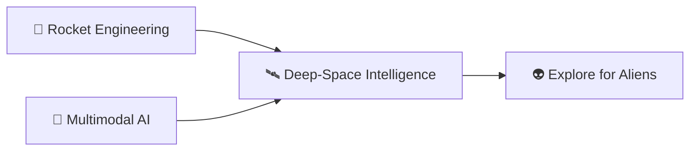

<p align="center">
  
</p>

<p align="center">
  <a href="https://git.io/typing-svg"></a>
</p>

<h2 align="center">🚀 Shogo Miyawaki — a.k.a. LoNebula 👽</h2>

<p align="center">
  <strong>Building bridges between Earth code and deep space intelligence.</strong>
</p>

<p align="center">
  
  
  
  
</p>

<p align="center">
  
  
</p>

---

### 🛸 About Me

```typescript
const lonebula = {
  name: "Shogo Miyawaki",
  handle: "LoNebula",
  affiliation: "JAIST — Graduate School",
  mission: "Explore for aliens. Build for Earth.",
  passions: ["Rocket Engineering", "Space Propulsion", "Multimodal AI", "SETI"],
  philosophy: "Anxious, but moving forward. Hesitate, think, then launch. 🚀",
  funFact: "I turn lecture notes into VS Code extensions and spacecraft dreams into Python."
};
```

---

### 🧬 Tech Stack — Proven in Production

> Everything below is backed by real repositories on this account. No buzzword bingo.

#### 1. Core Languages

<p align="left">
  <a href="https://github.com/LoNebula?tab=repositories&q=&type=&language=typescript"></a>
</p>

| Language | Where I Use It | Proof |
| :--- | :--- | :--- |
| **TypeScript** | VS Code extensions, Web apps | `powerpoint_viewer_extension` ⭐8, `kindle-highlights`, `our-universe`, `character-counter`, `Business-card-reader-app` |
| **Python / Jupyter** | LLM experiments, trading AI, Bayesian DL | `python_llm`, `lluminai`, `day_trade_ai`, `bayesian-deeplearning`, `Laboratory-blog-flask` |
| **C++** | Signal processing framework | `ssi` (Social Signal Interpretation, fork of hcmlab/ssi) |
| **HTML** | Knowledge base, lab sites | `knowledge`, `laboratory-website` |

#### 2. AI / Data Science

<p>
  
  
  
  
  
  
</p>

```python
# What I actually do with Python
# python_llm: building my own Python-specialized LLM
# bayesian-deeplearning: uncertainty-aware neural nets
# day_trade_ai: quantitative trading experiments
# lluminai: blog + notebook research logs
```

#### 3. Web / Extensions / Tooling

<p>
  
  
  
  
  
</p>

```bash
# My most-starred work: VS Code extension that previews PowerPoint
git clone https://github.com/LoNebula/powerpoint_viewer_extension.git
cd powerpoint_viewer_extension && npm install && npm run compile
# Press F5 in VS Code to launch the Extension Host
```

#### 4. Infra / Workflow

<p>
  
  
  
  
  
</p>

- 🐳 Docker-first development (`ds` container for data science)
- ⚡ GitHub Actions for metrics, 3D contrib graphs, and contribution snake
- 📝 Obsidian second-brain + RAG knowledge base

---

### 🛰️ Currently in Orbit

- 🔭 Building a Python-specialized LLM from scratch (`python_llm`)
- 📔 Writing the `lluminai` research blog — code + notes in the open
- 🎖️ Shipping VS Code extensions people actually star (`powerpoint_viewer_extension`)
- 🛸 Long-term: propulsion + onboard AI for deep-space exploration



---

### 🌌 Stack at a Glance

<p align="center">
  
</p>

<p align="center">
  
</p>

<p align="center"><sub>🌠 “Hesitate, think, then launch.” — LoNebula</sub></p>
