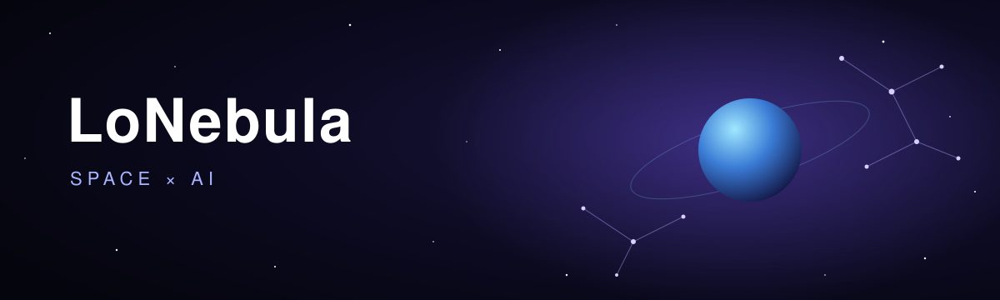

  Shogo Miyawaki · Graduate student at JAIST 
  Right now I'm into <b>space</b> 🌌 and <b>AI</b> 🧠

  

  🧩 <a href="https://github.com/LoNebula/powerpoint_viewer_extension">PowerPoint Viewer</a> ·
  <a href="https://github.com/LoNebula/kindle-highlights">Kindle Highlights</a> ·
  <a href="https://github.com/LoNebula/character-counter">Character Counter</a> 
  🧠 <a href="https://github.com/LoNebula/lluminai">lluminai</a> ·
  <a href="https://github.com/LoNebula/python_llm">python_llm</a> ·
  <a href="https://github.com/LoNebula/bayesian-deeplearning">bayesian-deeplearning</a> 
  ✍️ <a href="https://zenn.dev/p/lluminai_tech">Lluminai on Zenn</a>

