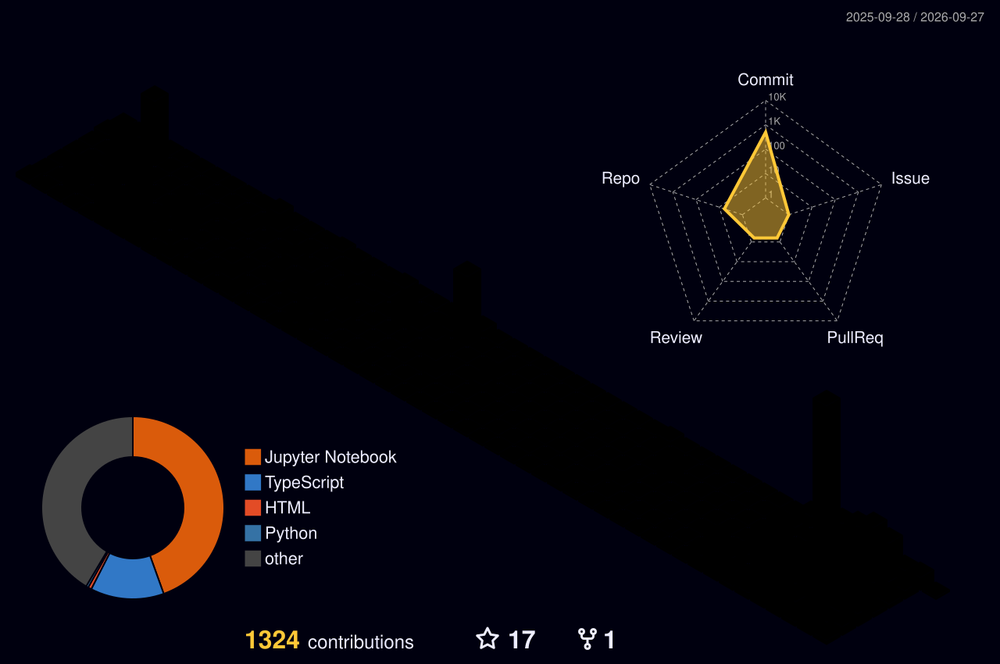

<p align="center">
  
</p>

<p align="center">
  <a href="https://git.io/typing-svg"></a>
</p>

<h2 align="center">🚀 Shogo Miyawaki — a.k.a. LoNebula 👽</h2>

<p align="center">
  
  <a href="https://marketplace.visualstudio.com/publishers/LoNebula9"></a>
  <a href="https://zenn.dev/p/lluminai_tech"></a>
</p>

<p align="center">
  
  
</p>

---

### 🛸 About Me

```typescript
const lonebula = {
  name: "Shogo Miyawaki",
  handle: "LoNebula",
  affiliation: "JAIST — Graduate School",
  loves: ["AI", "Space"],
  builds: ["VS Code extensions", "LLM / ML experiments", "Lab websites"],
  philosophy: "Hesitate, think, then launch. 🚀",
};
```

---

### 🧩 VS Code Extensions

> Built with TypeScript. Star counts are live.

| Extension | What it does | Links |
| :--- | :--- | :--- |
| 📊 [**PowerPoint Viewer**](https://github.com/LoNebula/powerpoint_viewer_extension) | Preview `.pptx` inside VS Code as continuous vertically scrolling slides (rendered via LibreOffice), with zoom | <a href="https://marketplace.visualstudio.com/items?itemName=LoNebula9.powerpoint-viewer"></a>  |
| 📚 [**Kindle Highlights**](https://github.com/LoNebula/kindle-highlights) | Sync Kindle `My Clippings.txt` into Markdown notes with Nunjucks templates — no Amazon login | <a href="https://marketplace.visualstudio.com/items?itemName=LoNebula9.kindle-highlights"></a>  |
| 🔢 [**Character Counter**](https://github.com/LoNebula/character-counter) | Live character / word / line counts for the document or selection in the status bar | <a href="https://marketplace.visualstudio.com/items?itemName=LoNebula9.character-counter"></a>  |
| 🎌 [**Japanese Char Counter**](https://github.com/LoNebula/japanese-char-counter) | Status-bar counter for total vs. Japanese-only characters, plus a word-wrap toggle (VS Code & Cursor) — not yet on the Marketplace |  |

---

### 🧠 AI / ML Projects

| Repository | What's inside | Stack |
| :--- | :--- | :--- |
| 📔 [**lluminai**](https://github.com/LoNebula/lluminai) | Code behind the [Lluminai](https://zenn.dev/p/lluminai_tech) blog — LLM, RAG and agent experiments | Python · PyTorch · LangGraph · FastAPI · Docker |
| ⚡ [**python_llm**](https://github.com/LoNebula/python_llm) | Work toward a Python-specialized LLM, starting from a GPU-enabled PyTorch Docker Compose environment | PyTorch · CUDA · Docker Compose |
| 🎲 [**bayesian-deeplearning**](https://github.com/LoNebula/bayesian-deeplearning) | Uncertainty-aware neural nets with MC Dropout and variational inference | PyTorch · Jupyter |
| 📈 [**day_trade_ai**](https://github.com/LoNebula/day_trade_ai) | Loss-avoidance day-trading classifier, NTT (9432) case study, with backtests | Python · LightGBM |

### 🌐 Web

| Repository | What's inside | Stack |
| :--- | :--- | :--- |
| 🧪 [**Laboratory-blog-flask**](https://github.com/LoNebula/Laboratory-blog-flask) | Lab research blog & portal with authentication and member pages | Flask · SQLAlchemy · MySQL |
| 🏛️ [**laboratory-website**](https://github.com/LoNebula/laboratory-website) | Responsive academic lab website with video hero and scroll animations | HTML · CSS · JavaScript |
| 📇 [**Business-card-reader-app**](https://github.com/LoNebula/Business-card-reader-app) | Client-side business-card capture and contact manager with CSV export | React · TypeScript · Vite · Tailwind |

### 🔧 Tooling

- 🧰 [**kulala-core**](https://github.com/LoNebula/kulala-core) — rebuilt all-platform binaries of kulala-core (from the andycowan recovery fork) for use with `kulala.nvim`
- 🔀 [**ssi**](https://github.com/LoNebula/ssi) — fork of the Social Signal Interpretation (SSI) framework

---

### 🧬 Tech Stack

<p align="center">
  
</p>

---

### 📊 GitHub Stats

<p align="center">
  
</p>

<p align="center">
  
  
</p>

<details>
<summary><b>More metrics</b></summary>
<p align="center">
  
</p>
</details>

<p align="center"><sub>Graphs are regenerated daily by GitHub Actions (<a href="https://github.com/lowlighter/metrics">lowlighter/metrics</a>, <a href="https://github.com/yoshi389111/github-profile-3d-contrib">github-profile-3d-contrib</a>).</sub></p>

<p align="center">
  
</p>

<p align="center"><sub>🌠 “Hesitate, think, then launch.” — LoNebula</sub></p>
